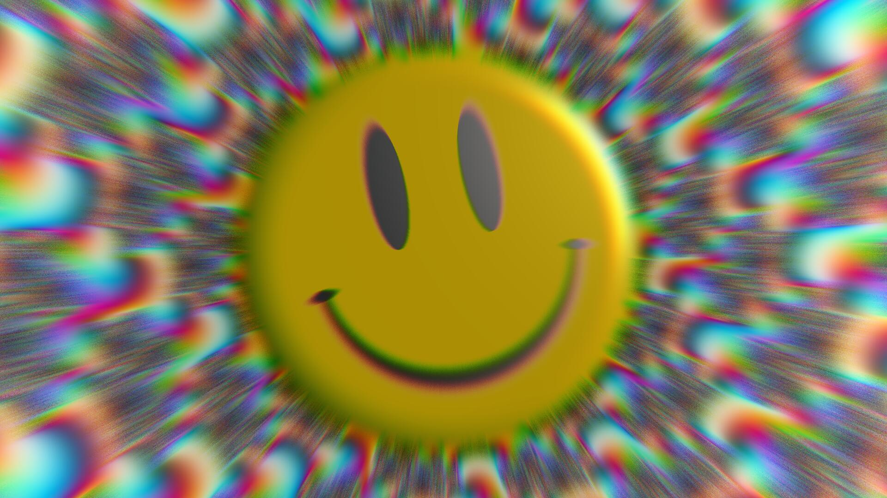

# AKIBA ACID EXPERIENCE 8K



```

                a k i b a
                █▀▀▀█ █  ▄▀ █ █▀▀█  █▀▀▀█
                █▀▀▀█ █▀▀▄  █ █▀▀▀█ █▀▀▀█
                ▀   ▀ ▀   ▀ ▀ ▀▀▀▀▀ ▀   ▀
                      s h a d e r
                      █▀▀▀▀ █   █ █▀▀▀█ █▀▀▀▄ █▀▀▀▀ █▀▀▀█
                      ▀▀▀▀█ █▀▀▀█ █▀▀▀█ █   █ █▀▀▀▀ █▀▀█▀
                      ▀▀▀▀▀ ▀   ▀ ▀   ▀ ▀▀▀▀  ▀▀▀▀▀ ▀   ▀
                                  s q u a d
                                  █▀▀▀▀ █▀▀▀█ █   █ █▀▀▀█ █▀▀▀▄
                                  ▀▀▀▀█ █  ▄█ █   █ █▀▀▀█ █   █
                                  ▀▀▀▀▀ ▀▀▀▀▀ ▀▀▀▀▀ ▀   ▀ ▀▀▀▀
.-----------------------------------------------------------------------------.
|                                                                             |
|                     A K I B A   S H A D E R   S Q U A D                     |
|                                                                             |
|                                  presents                                   |
|                                                                             |
|               A K I B A   A C I D   E X P E R I E N C E   8 K               |
|                                                                             |
|                                    appeared at Akiba Executable Party 2026  |
|                                    2026-09-30 @ IV AKIHABARA, TOKYO, JAPAN  |
|                                                                             |
'-----------------------------------------------------------------------------'

  We are AKIBA SHADER SQUAD !!!!!!
    - 0b5vr: Code, Graphics, Music
    - gam0022: Graphics
    - kinankomoti: Graphics
    - Renard: Graphics
    - shivaduke: Graphics
    - soma_arc: Graphics

  Browser 8KB Intro

  WebGL, Web Audio, Shader Minifier, Zopfli, and a custom compressor
  heavily based on Roadroller.
  Shoutouts to Ctrl-Alt-Test, Google, and Kang Seonghoon !!

  We greet:
    0x4015 / Alcatraz / Altair / Brainlez Coders! / Conspiracy
    Ctrl-Alt-Test / dok & jon / draw(); / Epoch / Farbrausch / Loonies
    LIA / Logicoma / Luchak / Mercury / mfx / Nuance / NuSan / Prismbeings
    Razor1911 / Rebels / SESSIONS / SynapseRack / xplsv

-------------------------------------------------------------------------------

  We checked this intro run on:
    - AMD Ryzen 7 7800X3D
    - NVIDIA GeForce RTX 5070 Ti
    - Windows 11 25H2
    - Google Chrome 153
    - 1920 x 1080, 60Hz

-------------------------------------------------------------------------------

  AI usage disclosure:
    This production was created with the assistance of AI tools,
    including Claude Code, OpenAI Codex, and GitHub Copilot.

-------------------------------------------------------------------------------

  (c) 2026 Akiba Shader Squad
```

- [Run the intro](https://0b5vr.github.io/akiba-acid-experience-8k/)
- [YouTube](https://www.youtube.com/watch?v=vsKvB0Z0W38)
- TODO: pouët
- [Demozoo](https://demozoo.org/productions/398111/)

## Development

### Prerequisites

- [Node.js](https://nodejs.org)
- [pnpm](https://pnpm.io)
- [Deno](https://deno.land)
- [Shader Minifier](https://github.com/laurentlb/shader-minifier)
- [Zopfli](https://github.com/google/zopfli)

### Build

```sh
pnpm install
pnpm build
```

### Start dev server

```sh
pnpm install
pnpm dev
```

### Controls

These keyboard controls are available in the dev build:

- `Space`: pause / resume
- `←` / `→`: seek by 5s
- `Shift` + `←` / `→`: seek by 60s
- `Alt` + `←` / `→`: seek by one frame
- `Home`: jump to the beginning
- `End`: jump to the end

## License

[CC BY-NC 4.0](./LICENSE)
